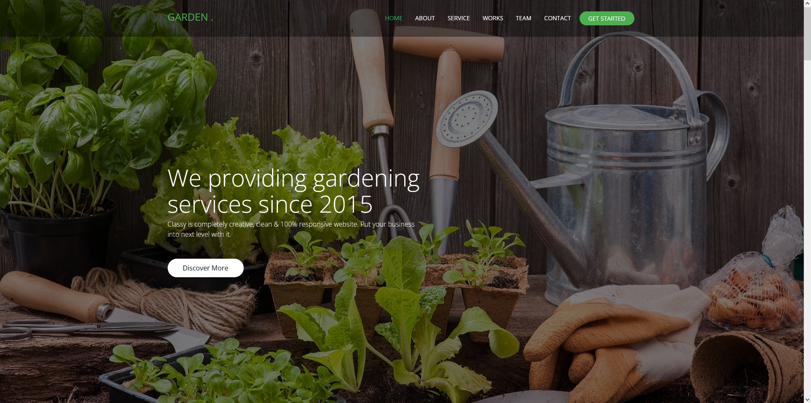
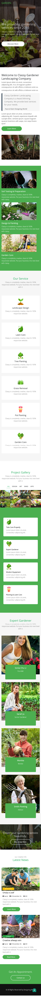

# 🌳 Gardan - One page html5 responsive template

**Gardan** is a modern, responsive landing page template built with **html** **CSS** and **bootstrap** & more, ideal for **web developers**, **startups**, **SaaS garden**, and **garden portfolios**. Designed with clean UI/UX, speed, and SEO in mind.


---

## 🖼️ Template Banner

<p align="center">
  
</p>


---

## ✨ Key Features

- 🌑 Sleek **Light Themed UI**
- ⚡ Pure Html CSS & Js
- 📱 Fully Responsive Design (Mobile, Tablet, Desktop)
- 🔍 **SEO Ready** with semantic structure
- 🔧 Modern Development Stack with reusability in mind
- 🎯 Great for Developers, Portfolios & Garden Products

---

## ⚙️ Tech Stack

- **HTML5**, **CSS3**, **Bootstrap CSS**
- **Jquery** & **fontawesome**
- **Vanilla JavaScript**
- **Responsive & Accessible Design**

---


## 💡 Why Choose the Bold Template?

✅ SEO-Friendly Markup  
✅ Fast & Responsive Layout  
✅ One Page Simplicity  
✅ Built With HTML5, CSS3 & Bootstrap  
✅ Developer Friendly & Easy to Customize  

---

## 💡 Creadit 

- [Bootstrap v4.4.1](https://getbootstrap.com/)
- [Fontawesome 5.11.2](https://fontawesome.com)
- [Jarallex 1.12.2](https://github.com/nk-o/jarallax)
- [Lightbox v2.11.1](http://lokeshdhakar.com/projects/lightbox2/)
- [model](http://github.com/kylefox/jquery-modal)
- [normalize v8.0.1](http://github.com/necolas/normalize.css)
- [preloader](https://css-loaders.com/)
- [isotop](https://isotope.metafizzy.co/)
- [jQuery v3.4.1](https://jquery.com/download/)
- [sticky v1.0.4](http://stickyjs.com/)
- [Modernizr v2.8.3](www.modernizr.com)
- wmbox

---

> 🚀 Use this template to launch your Garden site, portfolio, or client project quickly and effectively.

---

## 📁 Folder Structure

```bash
.
├── index.html
├── LICENSE
├── README.md
├── assets
    ├── css
    │   ├── bootstrap.min.css
    │   ├── fontawesome.css
    │   ├── jarallex.min.css
    │   ├── lightbox.min.css
    │   ├── main.css
    │   ├── model.min.css
    │   ├── normalize.css
    │   ├── preloader.css
    │   ├── responsive.css
    │   └── wmBox.css
    ├── images
    │   ├── close.png
    │   ├── g-01.jpg
    │   ├── g-1 (1).jpg
    │   ├── g-1.jpg
    │   ├── g-2 (01).jpg
    │   ├── g-2(1).jpg
    │   ├── g-2(2).jpg
    │   ├── g-2.jpg
    │   ├── g-3(1).jpg
    │   ├── g-3.jpg
    │   ├── g-4 (1).jpg
    │   ├── g-4.jpg
    │   ├── g-5.jpg
    │   ├── g-6.jpg
    │   ├── g-7.jpg
    │   ├── g-8.jpg
    │   ├── garden-1.jpg
    │   ├── garden-2.png
    │   ├── garden-3.jpg
    │   ├── garden-3.png
    │   ├── garden-4.jpg
    │   ├── garden-4.png
    │   ├── garden-5.jpg
    │   ├── garden-5.png
    │   ├── garden-6.png
    │   ├── garden.png
    │   ├── next.png
    │   ├── Only-me.png
    │   ├── play-button.png
    │   ├── prev.png
    │   ├── service-10.jpg
    │   ├── service-11.jpg
    │   └── service-12.jpg
    ├── js
    │   ├── bootstrap.min.js
    │   ├── fontawesome.js
    │   ├── isotope-docs.min.js
    │   ├── jarallex.min.js
    │   ├── jquery.js
    │   ├── jquery.sticky.js
    │   ├── lightbox.min.js
    │   ├── main.js
    │   ├── model.min.js
    │   ├── modernizr.js
    │   └── wmBox.js
    └── webfonts
        ├── fa-brands-400.eot
        ├── fa-brands-400.svg
        ├── fa-brands-400.ttf
        ├── fa-brands-400.woff
        ├── fa-brands-400.woff2
        ├── fa-regular-400.eot
        ├── fa-regular-400.svg
        ├── fa-regular-400.ttf
        ├── fa-regular-400.woff
        ├── fa-regular-400.woff2
        ├── fa-solid-900.eot
        ├── fa-solid-900.svg
        ├── fa-solid-900.ttf
        ├── fa-solid-900.woff
        └── fa-solid-900.woff2

```

---

## 🖼️ Template Preview

<p align="center">
  
  <p align="center" width="66%">
    **Tablet Preview**
    
  </p>
    <p align="center" width="33%">
    **Tablet Preview**
    
  </p>
</p>


---

## 👨‍💻 Developed by Yeachen Abir

I am a passionate **Full-Stack Developer** with a strong focus on **custom website development**, **on-page SEO**, and **digital marketing** strategies. My mission is to craft web solutions that **look stunning**, **perform fast**, and **rank well** on search engines.

### 🌟 CMS Expertise:
- Shopify | BigCommerce | WordPress | Wix  
- Custom CMS with React.js & Next.js  
- eBay Store Design & Optimization  
- Walmart Marketplace Product Optimization  

### 💻 Technical Skills:
- **Frontend**: JavaScript, React.js, HTML, CSS, SCSS, Tailwind CSS, Bootstrap  
- **Backend**: Node.js, Express.js  
- **Database**: MongoDB  
- **Version Control**: Git & GitHub  

### 📈 SEO & Digital Marketing:
- Keyword Research & Meta Optimization  
- On-Page SEO & Content Enhancement  
- Technical SEO: Speed, Mobile, Schema  
- Google Analytics & Search Console  

### 🔗 Let’s Connect!
- 💼 [LinkedIn](https://www.linkedin.com/in/yeachen-abir/)  
- 📘 [Facebook Profile](https://www.facebook.com/yeachen.abir) | [Facebook Page](https://www.facebook.com/profile.php?id=61574159927866)  
- 🐦 [Twitter / X](https://x.com/YeachenA)  
- 📸 [Instagram](https://www.instagram.com/yeachenabir/)  
- 📌 [Pinterest](https://www.pinterest.com/yeachenabir/)  
- 📬 Email: [yeachenabir@gmail.com](mailto:yeachenabir@gmail.com)

---

**#yeachen #abir #webdeveloper #shopify #wordpress #ecommerce #custom_website #react_developer #next_developer #fontend_developer #full_stack_developer**

---